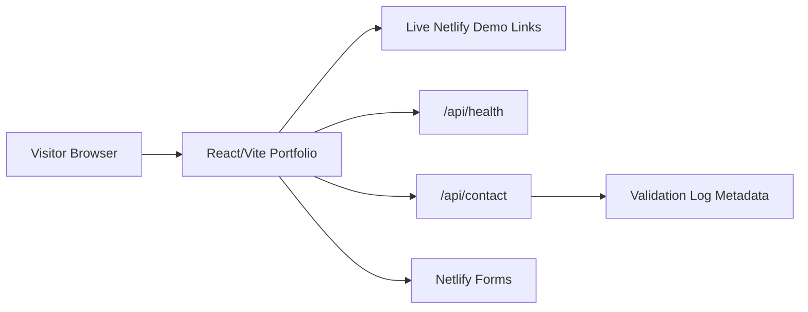

# Architecture

## Frontend

- React 19, TypeScript, Vite.
- CSS is project-local and asset-light.
- Hero uses a generated public-safe command-map image in `public/hero-command-map.png`.
- Demo gallery data is static and sourced from local manifests/docs.

## Backend

- `/api/health`: non-sensitive deployment and capability status.
- `/api/contact`: validates contact form payloads and returns a non-sensitive success response.
- Netlify Forms captures production submissions without adding email/API secrets to the repo.

## Security

- Strict CSP and frame protection in `netlify.toml`.
- No API keys or private credentials are required.
- Contact function logs only metadata lengths/domains, not message bodies.
